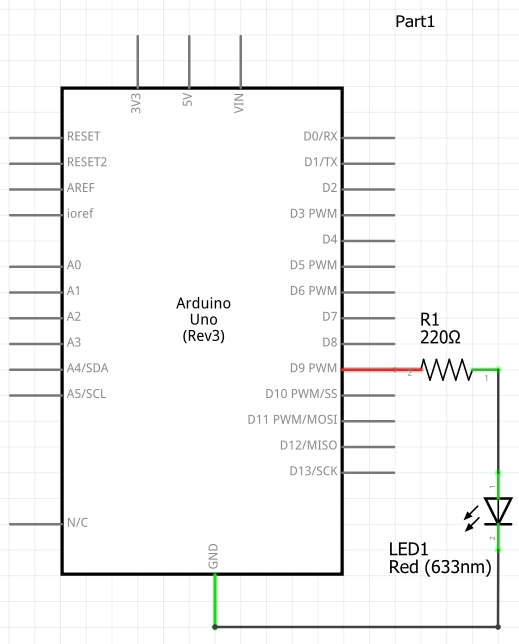
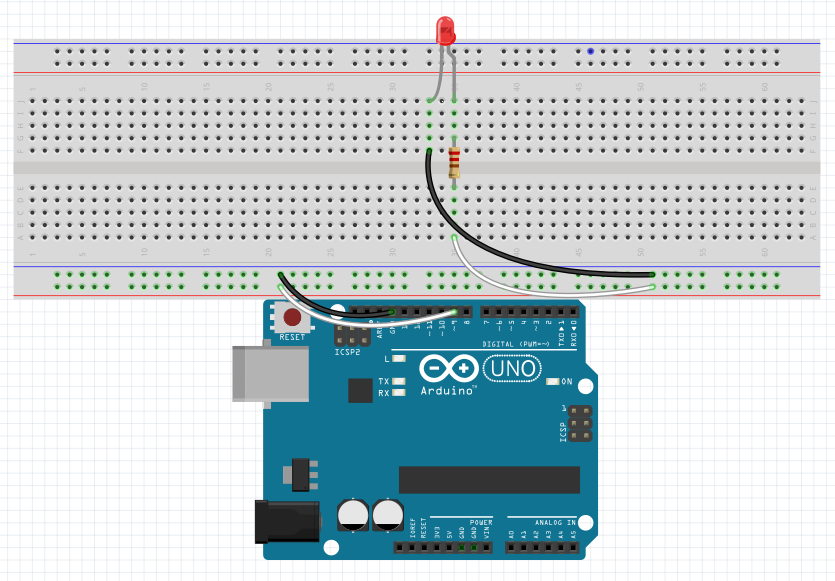

## Arduino PWM LED Brightness Control

This a simple script for controlling the brightness of an LED using PWM ([Pulse Width Modulation](https://www.arduino.cc/en/Tutorial/PWM)).

The Schematic is shown in the image schematic.png

The wiring diagram is shown in the image diagram.png

